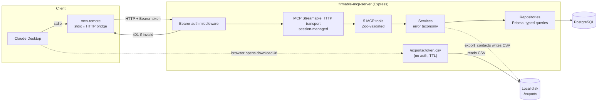

# Architecture

## System overview

## Layering

`mcp/tools/*` → `services/*` → `repositories/*` → `db/*`

- **Tools** (`src/mcp/tools/`): one file per MCP tool. Each is a thin adapter — a Zod input schema plus a call into a service. The Zod shape is registered directly with the SDK as `inputSchema`, so it does double duty: the SDK converts it to the JSON Schema advertised in `tools/list`, and it's the same schema used to validate incoming arguments before our handler ever runs (the SDK calls `safeParseAsync` on it internally). One schema, no duplication.
- **Services** (`src/services/`): business rules and error semantics. This is where "not found" vs "internal error" gets decided, and where `enrich_contact`'s enrichment framing lives (see below).
- **Repositories** (`src/repositories/`): Prisma queries only, no business logic. Column selection is explicit everywhere via `select`, never a bare `findMany()`/`findUnique()` that would return every column.
- **db** (`src/db/client.ts`): a single `PrismaClient` instantiated with the `@prisma/adapter-pg` driver adapter (Prisma 7's generated TS client requires an explicit adapter rather than talking to the database through an implicit engine binary).

Each layer is independently testable without the MCP transport in the loop.

## Why Streamable HTTP instead of stdio

The assignment requires the server to "reject unauthenticated requests." Over stdio, the client spawns the server process directly — there's no real per-request network boundary to authenticate against, so "auth" would collapse into a config/env-var gate rather than something you can demonstrate rejecting with a client request.

Streamable HTTP gives a real request/response boundary: an Express `authMiddleware` sits in front of the MCP transport handler on the `/mcp` route and returns `401` for a missing or invalid `Authorization: Bearer <key>` header, testable directly with `curl` — independent of any MCP client.

Since Claude Desktop's native config format spawns local stdio processes, we bridge with [`mcp-remote`](https://www.npmjs.com/package/mcp-remote), a small proxy that speaks stdio to Claude Desktop and Streamable HTTP (with custom headers) to our server. See `examples/claude_desktop_config.json`.

## Session handling

MCP Streamable HTTP is stateful at the protocol level: a client sends `initialize` once, receives an `Mcp-Session-Id`, and reuses that id on every subsequent `tools/list` / `tools/call` for the same connection. The server keeps one `{McpServer, transport}` pair per session in an in-memory `Map`, created on `initialize` and torn down only when the transport actually closes — client disconnect or process exit (`src/mcp/transport.ts`). There is deliberately no idle-timeout eviction: a real chat client (Claude Desktop via `mcp-remote`) holds one session open for an entire conversation, and multi-minute gaps between tool calls are normal, not abandonment. An earlier version had a 30-minute idle TTL, which silently killed live sessions mid-conversation — and because MCP clients generally have no built-in recovery for a dead session (see below), that left the connector permanently broken until Claude Desktop was restarted.

This is in-memory only — restarting the server (a crash, or `tsx watch` auto-restarting on a file save in dev) drops all sessions and, with no idle TTL, requires the client to reconnect from scratch. That's an acceptable trade-off for a single-instance demo deployment; a horizontally-scaled or long-running production deployment would want a shared session store (Redis) or sticky sessions, plus a much longer idle TTL (hours, not minutes) as a safety net against truly abandoned sessions.

An unknown or expired `Mcp-Session-Id` gets a spec-correct `404` with error code `-32001 "Session not found"` (matching the MCP SDK's own reference server convention), logged at `warn` — not a bare, unlogged `400`. This matters because `mcp-remote`'s client transport has no special recovery path for a dead session: it only auto-retries on `401`/`403` for auth flows, and its cached session id is only ever cleared by an explicit client-initiated `terminateSession()` call — never automatically after a failed request. So once a session is gone, the bridge keeps resending the same dead id until Claude Desktop is fully restarted; the best the server can do is make that failure visible (proper status code, logged) rather than silent.

## Authentication

Single static API key via the `API_KEY` env var, checked with `crypto.timingSafeEqual` (`src/middleware/auth.ts`) to avoid a trivial timing side-channel. Missing/invalid → `401` with a structured JSON error body, logged at `warn`. No multi-tenant key store or per-key rate limits — deliberately out of scope for this assignment; see "Trade-offs" below.

## Enrichment design

`email` and `linkedin` are pre-seeded on the `contacts` table, but `contactRepository.search()` (used by `search_contacts`) selects an explicit column list — `{id, name, title}` — that structurally excludes them. It's not a filter applied after the fact; the columns are never fetched. `enrich_contact` calls a separate repository method (`findEnrichmentById`) and the service layer adds a small artificial delay plus a synthesized `source`/`confidence`/`lastVerified` payload, so it reads as a distinct enrichment lookup rather than "the same row with different JSON keys." `export_contacts` also excludes enrichment fields for the same reason — export and enrichment are deliberately different actions.

## Error handling

`src/mcp/errors.ts` defines `NotFoundError` / `ValidationError` / `InternalError`. Services throw these; repository-level DB errors are caught and re-wrapped by services, so a raw `pg` stack trace never reaches a tool handler. Every tool handler is wrapped by `withToolErrorHandling` (`src/mcp/toolHandler.ts`), which maps any failure — SDK-level Zod validation errors, domain errors, or anything unexpected — to a well-formed MCP `CallToolResult` with `isError: true`, logging full detail server-side while returning a safe message to the client. Malformed input (e.g. a non-UUID `companyId`) is actually caught one layer up, by the SDK itself, which validates against the same Zod schema before our handler runs and returns its own structured tool-error result — so both paths end in "structured error, not a crash," just at different layers.

## Logging

`pino`, structured JSON (pretty-printed only in development). Every tool call logs `{toolName, durationMs, outcome, errorCode?}` on completion; auth failures log at `warn` with path/method/IP (never the key itself, valid or not).

## Export flow

`export_contacts` writes a CSV to `./exports/<uuid>.csv` and returns `downloadUrl: <EXPORT_BASE_URL>/exports/<uuid>.csv`. That route is **intentionally outside the Bearer auth middleware**, served with a 1-hour TTL sweep:

- The point of a `downloadUrl` is that it can be pasted into a browser or handed to a system that has no MCP session — gating it behind the same API key would mean only an already-authenticated MCP client could ever open its own export link, which defeats the point of returning a URL instead of inline CSV bytes.
- Security is bounded instead of eliminated: the filename is a UUIDv4 (122 bits of entropy), the path param is regex-validated as UUID-shaped before touching the filesystem (no path traversal), the exports directory isn't listable, and files older than an hour 404 and get swept from disk.
- **Documented trade-off**: this is "public-with-obscurity + TTL," appropriate for a demo/take-home. A production system would issue signed, time-boxed URLs (e.g. S3 pre-signed URLs) or require a short-lived download token tied to the original MCP session.

## Trade-offs / explicitly out of scope

- **Rate limiting**: not implemented. The four non-functional pillars covered — type safety, validation, error handling, logging — already exceed the assignment's "any 2" minimum; rate limiting would be a per-key token bucket in front of the auth middleware as a natural next step.
- **Multi-tenant API keys**: a single static key is enough to demonstrate "reject unauthenticated requests" without building key issuance/rotation/storage.
- **In-memory session map**: fine for one server instance; would need a shared store to scale horizontally.
- **`search_contacts` default cap**: the assignment doesn't specify a `limit` param for this tool, but an internal cap of 50 results was added so a filterless call can't return the entire 200-row contacts table.
